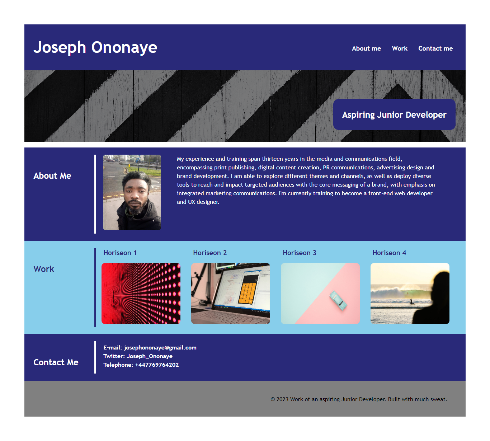

# portfolio-for-joseph
This is my portfolio page in its first stage. The page is built not only to showcase my professional capabilities in applications development, but to begin chronicling my growth from being an aspiring junior developer to a front-end web developer and UX designer.

The page has all the basic features of a typical portfolio page, namely:

* My name and professional title.
* My recent photo.
* About me section.
* My work section (with links).
* Contact me section.

## Structure & Style
I have used comments and appropriate html semantics to make the codebase easy to understand. The CSS file is also commented. The goal of these is to guide future code refactoring.

I adopted CSS flex styling to create the layout for the page. I also used a hero image to add a bit of aesthetics to the header section of the page.

## Future Challenge
At this stage, I have not been able to make the page responsive to smaller viewports. I hope to achieve this when I refactor the codebase. See image of the current page below.

## Mock-up

